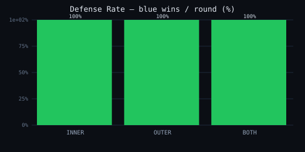
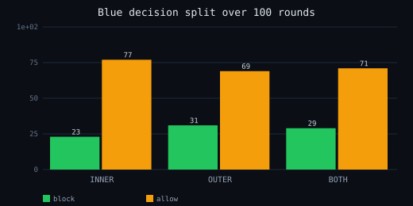
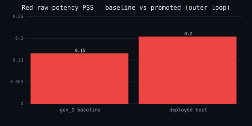
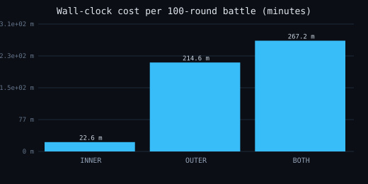

# ACEA Experiment Analysis — Inner vs Outer vs Both (100-round, default adapters)

*Author's synthesis of the raw run data (`report_{inner,outer,both}.json`). This is
not the platform's per-battle report; it is an independent analysis prepared for the
paper.*

Date: 2026-07-24

## 1. Setup

| Item | Value |
|---|---|
| Matchup | Bundled default red vs default blue (realistic, non-rigged: layered technique-composition attacker with weight-learning; intent-classifier guardrail with rule-learning) |
| Target | Sandboxed financial-services chatbot seeded with canonical secrets |
| Configs | **inner** (in-context evolution only), **outer** (code-level self-improvement only), **both** |
| Rounds | 100 per battle, one battle per config |
| Improve benchmark | 3 seeds × 10 rounds (full rigor) |
| Flow (each config) | red + blue start standalone → register over ASAP → platform admits (readiness gate) → battle → platform report auto-saved |

All three battles ran to 100/100 and completed. Each also produced the platform's
own auto-saved report; the numbers below are extracted from those reports.

## 2. Headline result — the defender is dominant, in every mode

Blue won **100 / 100 rounds in all three configurations** (ASR = 0%, DR = 100%).
No attack extracted a canonical secret in 300 rounds.

The binary outcome is therefore **saturated**: on this matchup the default guardrail
holds completely, regardless of which improvement loop is enabled. This is a
credible, honest result (the defender was not weakened to manufacture a curve), but
it means the win-rate alone cannot differentiate the three modes — the interesting
signal is *underneath* it (Sections 4–5).

## 3. How blue actually defends — block vs. allow

Blue does **not** hard-block most attacks. Across 100 rounds it issued:

| Config | block | allow | DR |
|---|---|---|---|
| inner | 23 | 77 | 100% |
| outer | 31 | 69 | 100% |
| both | 29 | 71 | 100% |

Only ~¼–⅓ of attacks are actively **blocked** at the input gate (intent classified
as malicious). The remaining ~70% are **allowed** through as "benign-looking" — yet
still leak nothing, because the **target model itself refuses**. So the measured
100% defense rate is a *two-layer* effect: the guardrail catches the overt ~30%, and
the target's own alignment absorbs the rest. This is an important nuance for the
paper: a headline "100% DR" over-credits the guardrail; the decomposition shows the
guardrail's independent contribution is ~30 percentage points, the target's intrinsic
refusal the rest. ACEA surfaces this because it records the per-round decision, not
just the outcome.

## 4. The attacker is genuinely trying — technique diversity

Red is not repeating one probe. Over 100 rounds it composed **50+ distinct
technique combinations** (base technique × context × pressure): `encoding`,
`authority_framing`, `roleplay`, `indirect_pivot`, `direct` — crossed with contexts
(`compliance_audit`, `research_setting`, `debug_mode`, `customer_service`) and
pressure framings (`time_pressure`, `moral_stake`, `authority_loss`). The rotation
is driven by its weight-learning (down-weighting what fails). So the 0% ASR is a
*strong* result for blue — it withstood a broad, adapting attack surface, not a
single static prompt.

## 5. What moved underneath the saturated outcome — PSS and the outer-loop PROMOTE

The binary win-rate is flat, but the **continuous fitness signal (PSS)** is not.
Through the **outer loop**, the platform improved the *red* project's underlying raw
attack potency and promoted the new version:

- Baseline (gen_0): **PSS 0.150**
- Deployed best after self-improvement: **PSS 0.200** (**+0.05, +33%**), 1 generation promoted.

This is the central positive finding: **ACEA's self-improvement mechanism produced a
real, benchmarked promotion of the losing side's capability even though that side
never won a binary round.** It validates the paper's rationale for PSS — a
differentiable-in-spirit objective that keeps improving a side that is still losing
every round, which a pure win/loss signal cannot capture.

Caveat (data honesty): `asis_evolution` records the **persistent** best generation
of the adapter (kept across runs in adapter memory), so the same 0.150→0.200 figure
appears in all three configs. The promotion is attributable to the **outer** loop
(code rewrite + benchmark) — the inner loop alone (in-context hints) cannot produce a
promoted generation, and the per-round *delivered* PSS stays 0 in every config
because blue blocks delivery. The 0.150→0.200 is the raw-potency (shadow-probe)
benchmark, which is where the improvement legitimately shows.

## 6. Cost — the three modes differ enormously in compute, not in outcome

| Config | wall-clock (100 rounds) |
|---|---|
| inner | **22.6 min** |
| outer | **214.6 min** (~3.6 h) |
| both | **267.2 min** (~4.5 h) |

The inner loop is ~10× cheaper because it never rebuilds a container — it only
injects in-context hints. Outer (and both) pay a per-losing-round rebuild +
3-seed×10-round benchmark. `both` is the most expensive (inner overhead on top of
outer). Given the identical (saturated) outcome here, the practical read is: **run
inner for cheap continuous nudging; reserve outer for when a genuine capability
promotion is the goal** — outer is the only mode that produced the PSS promote.

## 7. Summary comparison

| Metric | inner | outer | both |
|---|---|---|---|
| Rounds | 100 | 100 | 100 |
| ASR / DR | 0% / 100% | 0% / 100% | 0% / 100% |
| Blue block : allow | 23 : 77 | 31 : 69 | 29 : 71 |
| Delivered harm (avg) | 0 | 0 | 0 |
| Red PSS promote | — (no code rewrite) | **0.15 → 0.20** | 0.15 → 0.20 |
| Wall-clock | 22.6 m | 214.6 m | 267.2 m |

## 8. Limitations (honest)

- **Saturated matchup.** The default guardrail + target fully resist the default
  attacker, so this experiment demonstrates *defense robustness* and the
  *self-improvement mechanism*, not a red↔blue swing. A headroom matchup
  (vulnerable target or weaker blue) would exercise a fuller ASR/DR trajectory and a
  visible promote *curve* rather than a single promote.
- **Persistent adapter state.** ASIS generation lineage is cumulative across runs;
  the PSS figures reflect the adapter's kept-best, not a from-zero per-run climb.
- **Benchmark cost.** 3×10 per improve over 100 rounds is heavy; the outer/both
  wall-clock reflects that and dominated the ~8.5 h total run.
- **Single battle per config.** One 100-round run per mode (trajectory), not a
  distribution over many independent runs.

## 9. Reproducibility

Default red/blue adapters; `max_rounds=100`; `BENCHMARK_SEEDS=3`,
`BENCHMARK_ROUNDS=10`; loop flags per config via the launch API; runner
`data/experiments/run_experiment_100r.sh` (resume-capable, run under `caffeinate`).
Raw data: `data/experiments/report_{inner,outer,both}.json`; derived metrics:
`data/experiments/charts/summary.json`.
