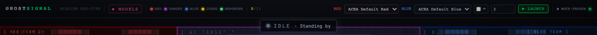
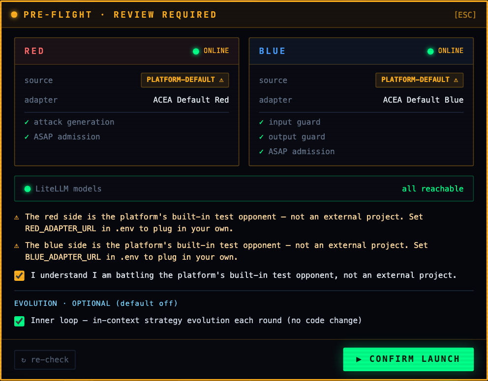

# Launching a battle

Two controls decide what a run is: the launch bar, and the pre-flight review it opens.

## The launch bar

Left to right: the red adapter, the blue adapter, the unlimited-rounds toggle, the round count, and `LAUNCH`.
The tag on the right reports the data mode, so a mock run can never be mistaken for a real one at a glance.

The adapter dropdowns list what registered successfully.
A project that failed admission does not appear, which is deliberate: you cannot accidentally launch against something that never satisfied the protocol.

With the unlimited toggle on, the round field is ignored and the battle runs until you stop it.
There is no automatic saturation stop in either mode.

## The pre-flight review

`LAUNCH` does not start the battle.
It opens a readiness gate.

The two cards are the sides as the platform sees them, not as you configured them.
Each shows whether the side is online, where it came from, the adapter name it declared, and the capabilities it declared.
Red declares attack generation; blue declares an input guard and an output guard.
Both must clear ASAP admission.
Below that, one line for the model roster.

The warnings in the capture matter more than they look.
Both sides are the bundled sample adapters that ship with this repository, so the gate says so in plain words and makes you tick a box acknowledging it before you can proceed.
Those samples are ordinary external projects that this repository happens to author.
They connect over the same protocol as anybody else's and get no privileged path through the platform, but a result measured against them is a result against a sample opponent, and a report should never be read as if it came from a third-party project.
Point `RED_ADAPTER_URL` or `BLUE_ADAPTER_URL` at your own project and the warning goes away.

## The evolution toggle

It defaults to off, and it is chosen per battle.

**Inner loop** is in-context strategy evolution.
Each round, the losing side's helpers analyse what happened and inject a new strategy into the next round's request.
No code is changed anywhere.

With it off, the arena is a plain adversarial evaluation.
That is the right setting for a baseline, and the report states whether the loop was on for the run.

`re-check` re-runs the readiness probes without closing the dialog, which is what you want after restarting a service.
`CONFIRM LAUNCH` starts the battle.
