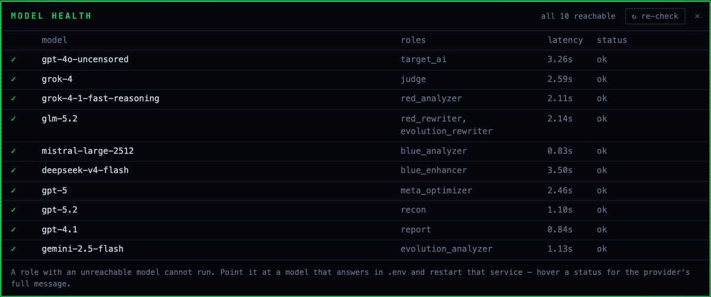

# Model health

Every model call in the platform goes through one LiteLLM proxy. The model health panel is the answer to "is the thing I pointed this role at actually answering".

One row per role, with the model that role is bound to, the roles sharing it, the latency of the probe, and the status. The header reports how many of the roster is reachable, and `re-check` probes again. The provider prefix is trimmed out of the capture; on your own screen each name appears in full as you wrote it in `.env`.

Roles are separate on purpose. The target, the judge, the red analyzer, the red rewriter, the blue analyzer, the blue enhancer, the meta optimizer, the recon analyst, the report writer and the evolution analyzer are configured independently in `.env`, and a model can serve more than one of them. The capture shows one model bound to both the red rewriter and the evolution rewriter.

A role whose model is unreachable cannot run, and the platform does not paper over that. Hover a status to read the provider's own message rather than a translated summary. The fix is to point that role at a model that answers and restart the service.

Two failure modes worth knowing, because both have cost us a run:

A reasoning model in the report role can spend its whole budget thinking and return no visible content. The probe passes, the report comes out empty. Use a model that returns content for that role.

An empty response is not the same as a failed call. The narrative generator retries with a smaller budget and then reports what actually happened, so a report that says the narrative is unavailable is telling you the truth rather than hiding a misconfiguration.
